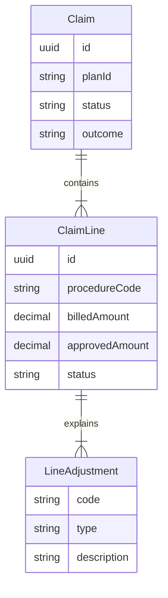
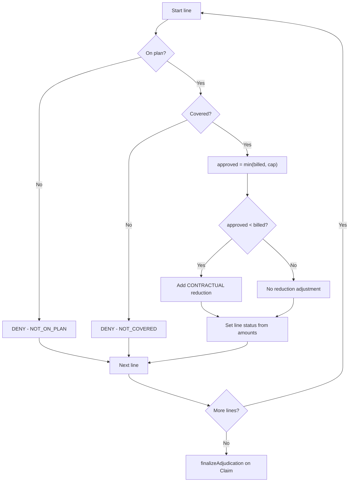

# Domain model — health insurance claims

This document describes how the insurance workflow is modeled in code: what each entity represents, how they relate, and how adjudication produces outcomes and explanations.

---

## How a real claim maps to the model

When a provider bills for services, the payer receives a **claim** with one or more **service lines** (each procedure or visit). The payer checks the member’s **plan**, decides what is covered, and may pay the full amount, a reduced amount, or nothing. If something is denied or reduced, the member needs a **reason**.

This project mirrors that flow:

| Real world | Model |
|------------|--------|
| Claim form (header) | `Claim` |
| Individual services billed | `ClaimLine` |
| “Why we didn’t pay full” | `LineAdjustment` |
| Where the claim is in processing | `ClaimStatus` |
| Result per service line | `LineStatus` |
| Overall result for the whole claim | `ClaimOutcome` |

---

## Core entities

### Claim

The **header** for one submission: who was treated, under which plan, and for what date range.

| Field | Purpose |
|-------|---------|
| `memberId` | Person receiving care |
| `providerId` | Who performed the service |
| `planId` | Which coverage rules apply (e.g. `PLAN-BASIC`) |
| `serviceFrom` / `serviceTo` | Service period on the claim |
| `status` | Processing stage (`SUBMITTED` or `ADJUDICATED`) |
| `outcome` | Overall result after adjudication (`APPROVED`, `PARTIAL`, `DENIED`) |
| `totalBilled` / `totalApproved` | Sum of line amounts |
| `lines` | Service lines belonging to this claim |

`Claim` is the unit you submit, adjudicate, and retrieve via the API. It owns its lines: saving or deleting a claim includes its lines.

### ClaimLine

One **billable service** on a claim (e.g. an office visit, a procedure).

| Field | Purpose |
|-------|---------|
| `lineNumber` | Order of the line on the claim (1, 2, 3…) |
| `procedureCode` | What was done (simple string in this MVP) |
| `diagnosisCode` | Optional clinical context |
| `serviceDate`, `units` | When and how much |
| `billedAmount` | Amount submitted |
| `approvedAmount` | Amount approved after rules (set at adjudication) |
| `status` | Line result (`PENDING` → `APPROVED` / `REDUCED` / `DENIED`) |
| `adjustments` | Explanations for denials or reductions |

### LineAdjustment

A **structured explanation** attached to a line—not a separate table with its own lifecycle. It answers: *what happened*, *why*, and optionally *how much* was affected.

| Field | Purpose |
|-------|---------|
| `code` | Short reason code (e.g. `NOT_COVERED`, `CONTRACTUAL`) |
| `type` | `DENIAL` or `REDUCTION` |
| `description` | Text a human can read |
| `amount` | Dollar impact when relevant (e.g. billed − approved) |

---

## Relationships

```text
Claim (1) ────────── owns ──────────► (many) ClaimLine
                                              │
                                              └── embeds (many) LineAdjustment
```

- Every `ClaimLine` belongs to exactly one `Claim` (`claim_id` foreign key).
- `LineAdjustment` rows are stored in `line_adjustments`, keyed by `claim_line_id`.
- Policy/coverage data (`Policy`, `CoverageRule`) lives outside this model in `PolicyCatalog` (in-memory for the MVP).



---

## Why ClaimLine exists

Insurance rarely approves or denies an entire claim as a single lump sum. A member might have:

- Line 1: office visit → **approved**
- Line 2: experimental treatment → **denied**

If we only stored amounts on `Claim`, we could show totals but not **which service** failed or **why**. That blocks partial approval and clear member communication.

`ClaimLine` exists because:

1. **Coverage is evaluated per procedure** — each line has its own `procedureCode` matched against the plan.
2. **Partial approval is a first-class case** — some lines pay, some do not.
3. **Explanations belong to the service** — denials and reductions are tied to the line that triggered them.

The claim header then **rolls up** line results into totals and an overall `ClaimOutcome`.

---

## Claim lifecycle (`ClaimStatus`)

Only two states—enough for submit → adjudicate without maintaining extra states like `CLOSED` or `DRAFT`.

```text
SUBMITTED  ──►  ADJUDICATED
```

| Status | Meaning |
|--------|---------|
| `SUBMITTED` | Claim saved; lines are `PENDING`; ready for adjudication |
| `ADJUDICATED` | All lines processed; totals and `outcome` are set |

Adjudication is only allowed while the claim is `SUBMITTED` (`claim.assertSubmitted()`).

---

## Line lifecycle (`LineStatus`)

Each service line moves independently through adjudication.

```text
PENDING  ──►  APPROVED | REDUCED | DENIED
```

| Status | When |
|--------|------|
| `PENDING` | Claim submitted; line not yet adjudicated |
| `APPROVED` | `approvedAmount` ≥ `billedAmount` (and greater than zero) |
| `REDUCED` | `0 < approvedAmount < billedAmount` |
| `DENIED` | `approvedAmount` is zero |

Status is set from amounts in `ClaimLine.statusFromAmounts(billed, approved)` after rules run.

---

## Claim outcome (`ClaimOutcome`)

`outcome` is **not** a separate workflow step. It is computed from line statuses when adjudication finishes (`Claim.deriveOutcome()`).

| Outcome | Rule |
|---------|------|
| `APPROVED` | Every line is `APPROVED` |
| `DENIED` | Every line is `DENIED` |
| `PARTIAL` | Anything else (mix of approved, reduced, and/or denied) |

Examples:

- Two lines, both approved → `APPROVED`
- One approved, one denied → `PARTIAL`
- One reduced, one denied → `PARTIAL`
- All denied → `DENIED`

---

## Adjudication flow

Adjudication runs in `Adjudicator` after a claim is submitted. High-level steps:

```text
1. Load plan policy for claim.planId
2. For each ClaimLine (independently):
     a. Look up procedureCode in coverage rules
     b. Decide approved amount (or deny)
     c. Attach LineAdjustment(s) if needed
     d. Set line status from billed vs approved
3. Claim.finalizeAdjudication()
     - recalculateTotals()
     - deriveOutcome()
     - status = ADJUDICATED
```

### Per-line decision tree

```text
procedureCode not on plan?
  └─► DENIED, adjustment NOT_ON_PLAN

rule exists but not covered?
  └─► DENIED, adjustment NOT_COVERED

covered:
  approvedAmount = min(billedAmount, plan cap)
  if approvedAmount < billedAmount
    └─► add REDUCTION adjustment (CONTRACTUAL)
  set status from amounts (APPROVED / REDUCED / DENIED)
```



Coverage rules for the MVP live in `PolicyCatalog` (in-memory). They are not part of the JPA domain graph but drive adjudication.

---

## Explanation / adjustment modeling

Explanations are **data on the line**, not log messages or a separate “explanation service.”

| Scenario | `type` | Example `code` | Typical `amount` |
|----------|--------|----------------|------------------|
| Procedure not on plan | `DENIAL` | `NOT_ON_PLAN` | 0 |
| Excluded procedure | `DENIAL` | `NOT_COVERED` | 0 |
| Paid less than billed | `REDUCTION` | `CONTRACTUAL` | billed − approved |

Why embed adjustments on the line?

- The API returns them with the line in one response.
- Auditors and members care about **per-service** reasons.
- Multiple adjustments per line are possible later (e.g. denial + copay) without changing the overall shape.

Factory helpers on `LineAdjustment` (`denial(...)`, `reduction(...)`) keep creation consistent in `Adjudicator`.

---

## How totals and outcome are derived

After all lines are processed, `Claim.finalizeAdjudication()` runs:

**Totals**

```text
totalBilled   = sum of each line.billedAmount
totalApproved = sum of each line.approvedAmount (null treated as 0)
```

**Outcome**

```text
if every line APPROVED     → outcome APPROVED
else if every line DENIED  → outcome DENIED
else                       → outcome PARTIAL
```

**Status**

```text
status = ADJUDICATED
adjudicatedAt = now
```

The claim header does not re-decide coverage; it **reflects** what happened on the lines.

---

## Money fields (MVP scope)

| Level | Fields | Notes |
|-------|--------|--------|
| Line | `billedAmount`, `approvedAmount` | Submitted vs plan-approved |
| Claim | `totalBilled`, `totalApproved` | Rolled up from lines |

Later extensions (deductible, copay, allowed vs paid) can add fields without changing the line-based adjudication shape.

---

## Related code

| Concept | Package / class |
|---------|------------------|
| Entities | `com.realfast.claims.model` |
| Adjudication | `com.realfast.claims.service.Adjudicator` |
| Coverage rules | `com.realfast.claims.policy` |
| API mapping | `com.realfast.claims.web.dto` |

For running the API and example requests, see the project [README](../README.md).
